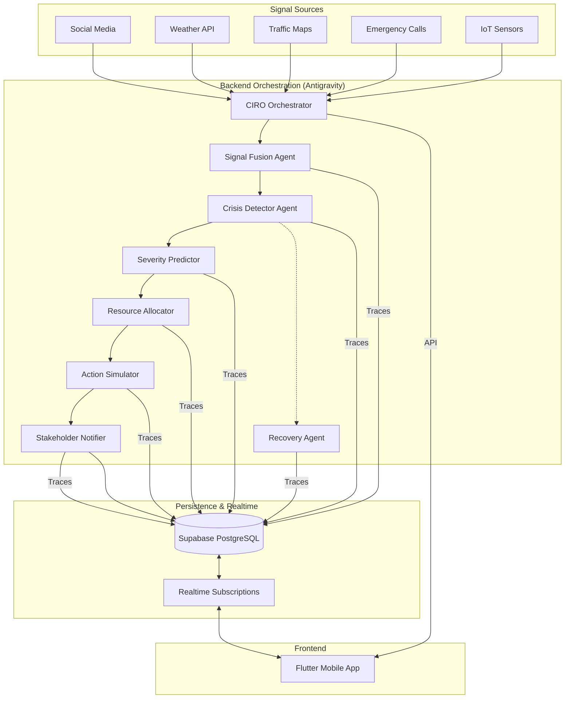

# CIRO System Architecture

## Data Flow
1. **Ingestion**: Raw signals from 5 sources are fetched.
2. **Analysis**: 7 AI Agents (powered by Gemini 2.0) process the signals.
3. **Storage**: All decisions, predictions, and traces are saved to Supabase.
4. **Visualization**: Flutter app listens for real-time updates and displays them on the map and dashboard.
